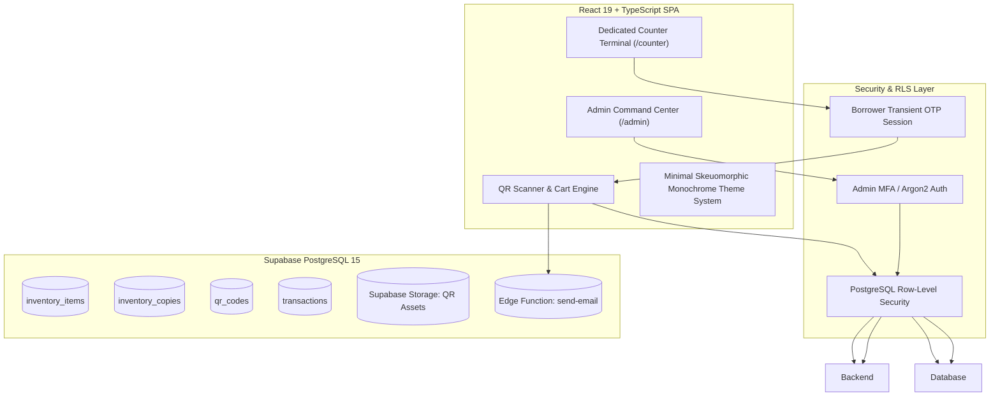
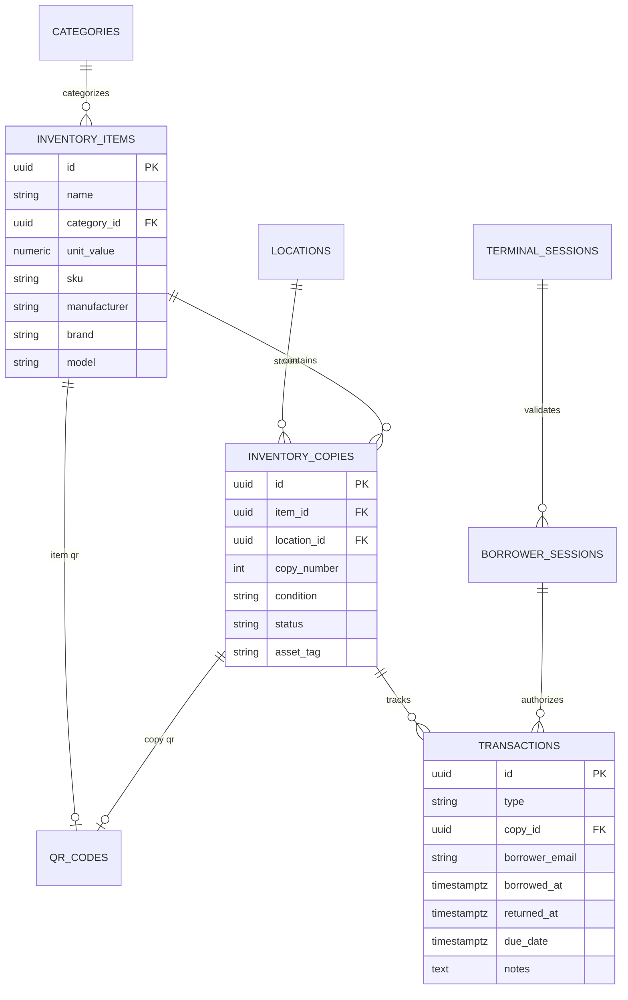

# Inventor Client — Enterprise Cloud Inventory Platform

[](https://www.typescriptlang.org/)
[](https://react.dev/)
[](https://vitejs.dev/)
[](https://tailwindcss.com/)
[](https://supabase.com/)
[](https://opensource.org/licenses/MIT)

> **Inventor Client** is a domain-agnostic, enterprise-grade cloud inventory and asset lifecycle management platform designed with a **Minimal Skeuomorphic Monochrome** design language. Engineered for universities, enterprise research labs, healthcare systems, high-throughput warehouses, and hardware engineering facilities.

---

## 📑 Table of Contents

- [System Architecture](#-system-architecture)
- [Design Philosophy & UI/UX System](#-design-philosophy--uiux-system)
- [Key Capabilities](#-key-capabilities)
  - [1. Dual Interface Topology](#1-dual-interface-topology)
  - [2. Minimal Skeuomorphic Command Dashboard](#2-minimal-skeuomorphic-command-dashboard)
  - [3. Shared Item QR & Physical Copy Auto-Resolution](#3-shared-item-qr--physical-copy-auto-resolution)
  - [4. Single-Sheet Unified Bulk Onboarding](#4-single-sheet-unified-bulk-onboarding)
  - [5. Transaction Lifecycle & Admin Overrides](#5-transaction-lifecycle--admin-overrides)
  - [6. Reporting & Analytics Engine with Custom Date Ranges](#6-reporting--analytics-engine-with-custom-date-ranges)
  - [7. Digital Receipts & Automated Due Date Reminders](#7-digital-receipts--automated-due-date-reminders)
- [Tech Stack](#-tech-stack)
- [Database Schema & Entity Relationships](#-database-schema--entity-relationships)
- [Security & Row-Level Security (RLS)](#-security--row-level-security-rls)
- [Getting Started](#-getting-started)
  - [Prerequisites](#prerequisites)
  - [Installation & Setup](#installation--setup)
  - [Available Scripts](#available-scripts)
- [Deployment](#-deployment)

---

## 🏛 System Architecture

Inventor Client is designed around a clean, feature-driven hexagonal architecture that strictly separates administrative operations from high-speed counter terminal interactions.



---

## 🎨 Design Philosophy & UI/UX System

Inventor Client employs a **Minimal Skeuomorphic Monochrome** design philosophy that pairs the clarity of Swiss graphic design and stark black-and-white palettes with the tactile satisfaction of physical hardware controls:

* **Tactile Surfaces (`.skeuo-card`)**: Multi-layered soft drop shadows coupled with a subtle 1px specular top highlight border (`inset 0 1px 0 rgba(255,255,255,...)`) replicating physical raised plates.
* **Recessed Etched Wells (`.skeuo-well`, `.skeuo-input`)**: Debossed inset shadows for text inputs, telemetry modules, and data grids giving a precision-machined instrument aesthetic.
* **Physical Hardware Controls (`.skeuo-button-primary`, `.skeuo-pill`, `.skeuo-led`)**: Extruded button bevels with active click depression (`translate-y-[1px]`), physical sliding slider switches for theme toggling, and pulsing LED status nodes.
* **High-Contrast Monochrome Palette**: High readability dark mode (obsidian/charcoal with crisp white typography and subtle ambient lighting) and light mode (chalk/paper white with deep ink contrast).

---

## 🌟 Key Capabilities

### 1. Dual Interface Topology
* **Admin Command Center (`/admin`)**: Multi-category inventory management, batch QR generation, sticker sheet printing layouts, transaction override ledgers, custom date range financial valuation reports, and audit tracking.
* **Counter Terminal (`/counter`)**: High-speed, touch-optimized kiosk designed for lab desks. Borrowers authenticate via transient 6-digit email OTPs without creating permanent user accounts.

### 2. Minimal Skeuomorphic Command Dashboard
* **Live Telemetry Bar**: Real-time infrastructure status badge with pulsing LED indicator and quick terminal launch trigger.
* **Metric Dials (4-Card Matrix)**: Total asset valuation, active borrowed loans, delinquent overdue alerts, and live stock availability percentage with grooved progress tracks.
* **Quick Operations Dock**: Tactile fast-action tiles for adding SKUs, bulk importing spreadsheets, printing sticker sheets, and auditing reports.
* **Stream Ledger & System Node Deck**: Two-column responsive command hub featuring segmented transaction filters (All / Borrows / Returns) and database/storage infrastructure node telemetry.

### 3. Shared Item QR & Physical Copy Auto-Resolution
* Supports both **Physical Copy QR Codes** (1 unique code per physical asset) and **Shared Item-Level QR Codes** (1 shared code per product category/bin).
* When a shared Item QR is scanned:
  * **Borrow Mode**: Auto-picks the earliest available physical copy (`copy_number ASC`) and reserves it.
  * **Return Mode**: Read-only borrower active loans checklist with live scan validation; auto-resolves the active borrowed copy and marks it returned.

### 4. Single-Sheet Unified Bulk Onboarding
* Import entire facility inventories from a **single `.xlsx` or `.csv` spreadsheet**.
* Automatically detects and creates missing Catalog Items, Categories, Locations/Racks, generates physical copy quantities, and generates vector QR codes in a single operation.

### 5. Transaction Lifecycle & Admin Overrides
* Immutable transaction ledger tracking `borrow`, `return`, `lost`, and `damaged` states.
* Real-time overdue loan tracking calculating days past return window.
* Full administrative override capabilities: **Force Return**, **Mark as Lost**, and **Mark as Damaged** with audit reason logging.

### 6. Reporting & Analytics Engine with Custom Date Ranges
* **Inventory Valuation & Stock Summary**: Real-time asset valuation by category and storage location.
* **Borrowing Volume Activity**: Borrow and return trends across arbitrary date windows.
* **Overdue Tracking**: Live overdue loan ledger with borrower contact details and days overdue.
* **Loss & Damage Write-Offs**: Financial impact audit of decommissioned or damaged assets.
* **Multi-Format Export**: 1-click export to CSV, multi-sheet formatted Excel (`.xlsx`), and clean print/PDF layouts.

### 7. Digital Receipts & Automated Due Date Reminders
* Instant digital receipt emails sent on every borrow and return transaction.
* Automated due date reminder engine notifying borrowers of upcoming or overdue items.

---

## 🛠 Tech Stack

| Layer | Technology | Purpose |
| :--- | :--- | :--- |
| **Framework** | [React 19](https://react.dev/) + [TypeScript 5.8](https://www.typescriptlang.org/) | Strict type-safety, zero-runtime overhead |
| **Build Tool** | [Vite 6](https://vitejs.dev/) | Sub-second HMR & optimized ESM bundling |
| **Styling** | [Tailwind CSS v4](https://tailwindcss.com/) + Custom Skeuomorphic System | Monochrome tokens, tactile bevels, physical depth |
| **State & Cache** | [TanStack React Query v5](https://tanstack.com/query/latest) | Optimistic mutations, background auto-polling |
| **Database & Auth** | [Supabase PostgreSQL](https://supabase.com/) | RLS, RPC functions, transient OTP auth, Storage |
| **Spreadsheets** | [SheetJS (xlsx)](https://docs.sheetjs.com/) | Parsing and generating Excel `.xlsx` / `.csv` |
| **QR Engine** | `qrcode` + SVG Rendering | High-resolution 300 DPI vector QR generation |
| **Testing** | [Vitest](https://vitest.dev/) + [JSDOM](https://github.com/jsdom/jsdom) | Fast unit & integration test runner |

---

## 🗄 Database Schema & Entity Relationships



---

## 🔒 Security & Row-Level Security (RLS)

- **Principle of Least Privilege**: Counter terminals operate through secure PostgreSQL `SECURITY DEFINER` RPC functions with strict parameter validation.
- **Strict RLS Enforcement**: Public anon users cannot query inventory records or transactions directly.
- **Transient Borrower Tokens**: Borrower tokens expire automatically after 10 minutes or upon explicit checkout.
- **Audit Logging**: Every state change, authentication attempt, import operation, and admin override is logged permanently to `audit_logs`.

---

## 🚀 Getting Started

### Prerequisites
- Node.js >= 20.x
- npm >= 10.x
- A Supabase Project ([supabase.com](https://supabase.com))

### Installation & Setup

1. **Clone the Repository**:
   ```bash
   git clone https://github.com/M-Sanjay-IND/iventor-client.git
   cd iventor-client
   ```

2. **Install Dependencies**:
   ```bash
   npm install
   ```

3. **Configure Environment Variables**:
   Create a `.env` file from `.env.example`:
   ```env
   VITE_SUPABASE_URL=https://your-project.supabase.co
   VITE_SUPABASE_ANON_KEY=your-anon-key
   VITE_COUNTER_DUE_DAYS=7
   VITE_COUNTER_EMAIL_DOMAIN=yourdomain.edu
   ```

4. **Apply Database Migrations**:
   Run the SQL scripts in `supabase/migrations/` sequentially inside your Supabase SQL Editor.

5. **Start Local Development Server**:
   ```bash
   npm run dev
   ```

---

## 📜 Available Scripts

| Command | Description |
| :--- | :--- |
| `npm run dev` | Launch local development server with Vite HMR |
| `npm run build` | Validate TypeScript and compile production bundle |
| `npm test` | Run automated test suite with Vitest |
| `npm run typecheck` | Perform strict TypeScript type checking (`tsc -b --noEmit`) |
| `npm run lint` | Run ESLint with zero-warning threshold |
| `npm run format` | Format codebase using Prettier |
| `npm run validate` | Complete CI verification (`typecheck + lint + format + test`) |

---

## 📄 License

Distributed under the MIT License. See `LICENSE` for details.
